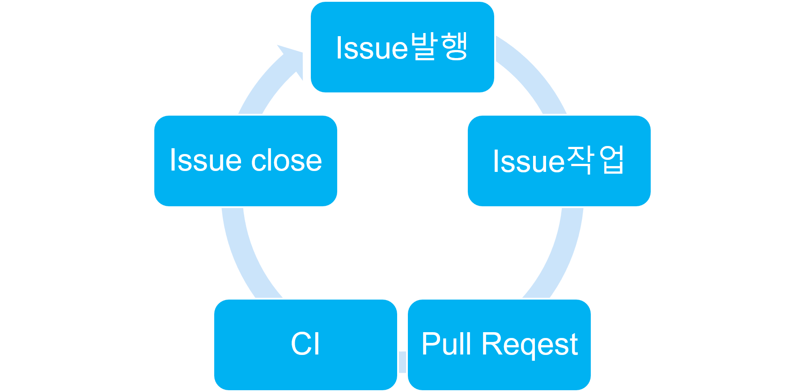
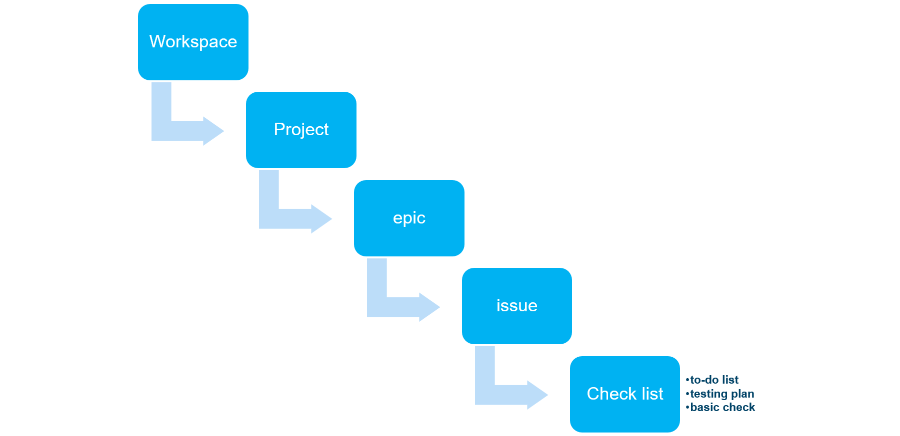
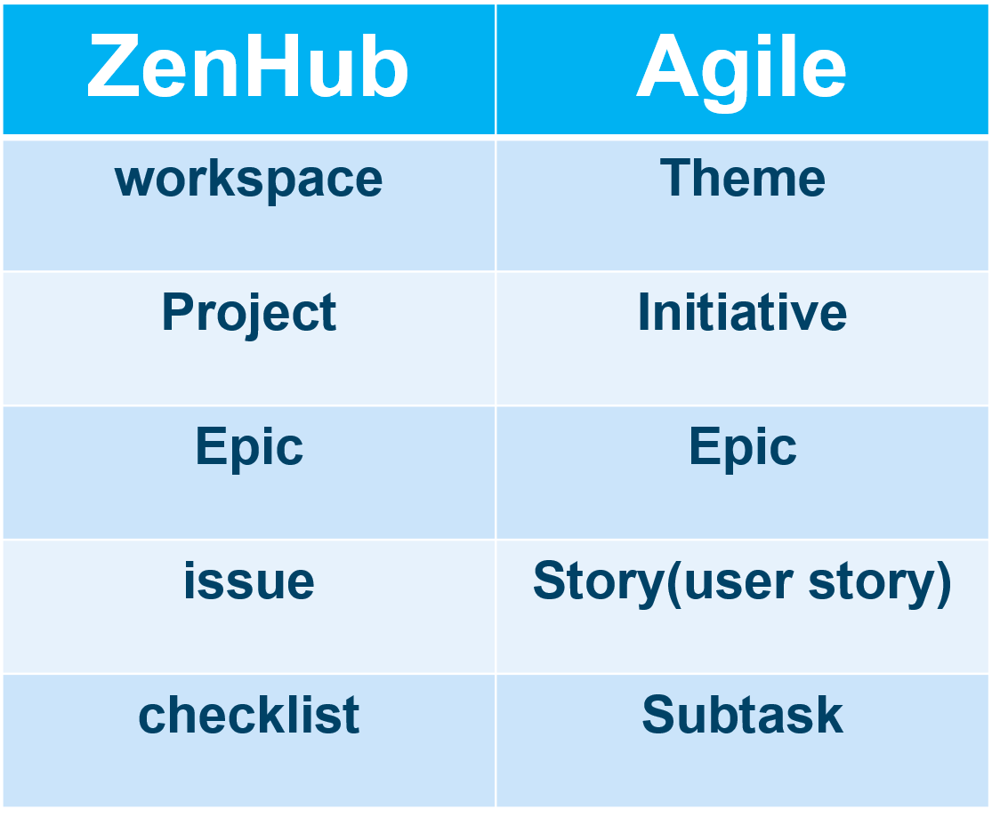

본 문서는 핵심인원이 교체될 때마다 edge of tomorrow를 재현하는 랩실을 위한 것이다. 

https://luckyyowu.tistory.com/370

https://velog.io/@dooyou21/%EC%8A%A4%ED%94%84%EB%A6%B0%ED%8A%B8-%EC%8A%A4%ED%81%AC%EB%9F%BC-%EC%95%A0%EC%9E%90%EC%9D%BC

https://github.com/cheese10yun/github-project-management
# 관리환경

# 전체 flow
 

1. Isuee 발행
2. Issue 작업
3. Pull Request
4. CI진행
5. Issue Close

# 인원관리
  ## 신규인원
  1. lab의 nas서버에 아이디추가
  2. slack에 초대
  3. github초대
  4. 정기적인 일정전달
  5. 식사관련 안내
  6. nas 사용규칙 전달
  7. zenhub 설치안내
  ## 졸업인원
    아직 협의 되지 않음
# 기타
  ## task 레벨
   

  위에서 사용된 용어들은 아래의 표대로 agile의 용어와 대응된다.

   

***

   ### workspace
   agile의 theme에 대응되는 것으로 연구실의 가장 큰 목표 (예: 진행중인 프로젝트나 작성중인 논문 등) 

***

   ### project 
   project는 공통된 목표를 달성하기 위한 epic의 모임이다.
   모든 project의 완료는 과제완료로 이어진다.
*** 

   ### epic 
   요구사항들로 분할이 가능한 작은 목표이다.
***
   ### story 
   가장작은 단위의 요구사항
***

  ## zenhub 사용법

  ## github 사용법

  ## github 사용지침
  0. base design
  1. prototyping (kickoff)
  2. development 

   ### branch 정책
   **master에 변경사항을 반영하기 위해서는 반드시 pull request를 해야한다.**

    새로운 branch는 issue를 해결하기 위해 생성하고 main에 병합하고 삭제 항상 존재

    branch naming:
    branch의 이름은 <작성자>-<이슈label>-이슈번호 로한다.
   ### commit 규칙
    english  
    1. Separate subject from body with a blank line
    2. Limit the subject line to 50 characters
    3. Capitalize the subject line
    4. Do not end the subject line with a period
    5. Use the imperative mood in the subject line
    6. Wrap the body at 72 characters
    7. Use the body to explain what and why vs. how
reference: https://chris.beams.io/posts/git-commit/

    <type>[optional scope]: <description>

    # Examples

    fix: allow login without uid
    feat: add chat function
    BREAKING CHANGE: 'extend' > 'inherit', must fix all the codes
    doc: add document about something
    testset: add test set for that branch 
    gittest: test git commend

    # Examples with optional scope

    fix(chat): broken emoji
    feat(auth): add Google Play Auth

reference: https://blog.cookapps.io/guide/conventional-commits/#%EC%82%AC%EC%9A%A9%EB%B2%95
   ### 이슈 라벨
   이슈는 매우 넓은 개념으로 의미를 한정하기위해 라벨을 지정한다.
   * epic : epic 이슈로 스플린트에 넣으면 안된다.
   * bug : 버그 이슈
   * story : epic에서 분할된 가장작은 요구사항(기능)이다.
   * setup : kickoff를 위한 준비(설계나 서버셋업 등을 요청하는 이슈다)
   * kickoff : prototype을 요청하는 이슈로 베이스가 되는 실행가능한 프로그램을 요구한다. 
   * document : 문서를 요구하는 이슈다.
   ### Pull Request(PR)운영
    *어떻게 사용하던 PR시 code review를 통해 원격 저장소를 유지한다.
    *fork는 막혀있으므로 branch만 사용한다.
    *branch는 기본적으로 issue를 close하기 위해 사용한다.
    *진행상황을 확인하고 어디서든지 계속작업할수 있도록 원격저장소의 브렌치에 계속 동기화한다.

    #branch생성
    git checkout -b <작성자>-<이슈label>-이슈번호
    
    #branch확인
    git branch
    
    #원격저장소에 branch 만들기
    git push origin <작성자>-<이슈label>-이슈번호
    
    #####
    수정작업
    #####
    

    git commit -m "커밋 메시지"
    git push origin <작성자>-<이슈label>-이슈번호
    
    #PR
    github 저장소로 들어와 pull request를 한다.
   ### CI 